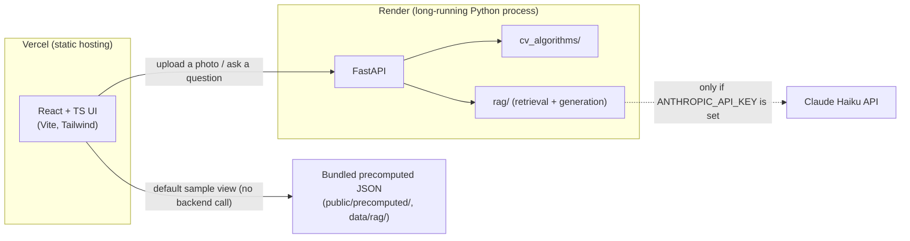
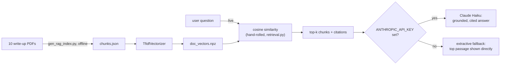

# AI Portfolio

[](https://github.com/andreag0101/ai-portfolio/actions/workflows/ci.yml)

**Live demo:** [ai-portfolio-lilac-gamma.vercel.app](https://ai-portfolio-lilac-gamma.vercel.app/)
<!-- NOTE: this URL currently redirects to Vercel's SSO login for anyone
     without access to the andreag0101 Vercel account/team -- it needs
     Vercel's Deployment Protection turned off (or the stable production
     domain used instead of this per-deployment preview URL) before it
     actually works as a public link. See the chat response this was
     added in for details. -->

A React + FastAPI site with three things in it: interactive computer vision
demos ported from coursework (ECE 661, Purdue) into from-scratch
implementations, deep learning write-ups (ECE 60146), and a
retrieval-augmented research assistant over those write-ups. The CV demos
are the bulk of it, so most of this README is about them; the Deep Learning
and Research Assistant sections further down cover the rest.

Every CV demo can be stepped through stage by stage instead of only showing
a final result, every demo that takes an image (or pair/sequence of images)
has a one-click "use a sample" option, and every sample dataset a demo needs
(calibration photos, a weather-photo training set, a face dataset,
car/non-car patches, and a curated sample input per demo) is bundled under
`backend/data/` so the whole thing runs standalone — no external files or
uploads required to try any of it.

## Architecture



The frontend and backend are deployed as two separate services (see
[Deployment](#deployment)) since the backend does real per-request compute
and can't run as static/serverless hosting. Every CV demo also ships a
bundled precomputed result, so the site still demonstrates every algorithm
even when the backend is slow to wake from an idle sleep.

## The 10 demos

- **Projective Geometry Playground** — point-line duality (cross products) as
  a live drag-the-triangle/drag-the-aim canvas.
- **Planar Rectification & Compositing** — automatic quadrilateral detection
  (Canny edges → contours → polygon approximation, filtered by
  rectangularity/angle sanity) + a 4-point DLT homography, to straighten a
  photographed plane or warp an image into a detected frame/screen.
- **Camera Calibration** — Zhang's method: a from-scratch Hough-line corner
  detector for a bespoke printable calibration pattern, per-photo
  homographies, the closed-form absolute-conic solution, and
  Levenberg-Marquardt refinement, stepped through corner detection → grid
  sorting → intrinsics → reprojection accuracy → 3D camera poses.
- **Corner Detection & Feature Matching** — a from-scratch Harris detector,
  SSD/NCC patch matching, plus an ORB+BFMatcher baseline for comparison.
- **Panorama Stitcher** — SIFT + a from-scratch RANSAC + Levenberg-Marquardt,
  stepped through interest points → inlier/outlier matching → the stitched
  result.
- **Interactive Image Segmentation** — iterative Otsu thresholding (RGB or
  texture) + morphological open/close + contours.
- **Texture-Based Weather Classification** — rotation-invariant circular LBP
  on the Hue channel, 1-nearest-neighbor against 922 bundled training photos.
- **Dense Stereo Depth Estimation** — census-transform window matching between
  a stereo pair, plus a step that unprojects the disparity map into an
  interactive, draggable 3D point cloud (three.js) colored from the source
  photo.
- **Face Recognition: Eigenfaces vs. Fisherfaces** — PCA and Fisher-LDA
  subspaces trained on 630 bundled photos of 30 people, 1-NN matching, a live
  held-out accuracy-vs-K chart, and the actual eigenface/fisherface basis
  images.
- **Car Detection: Haar Features + AdaBoost** — integral-image Haar-like
  features boosted with AdaBoost, Viola-Jones style, classifying cropped
  patches.

Several real bugs turned up in the original coursework code while porting it
(an axis mismatch in a `take_along_axis` call that silently corrupts AdaBoost
training, a sign/formula slip in the closed-form camera-intrinsics
extraction, a sort-direction bug that would greedily commit the *worst*
feature matches first) — each is documented with a before/after explanation
in the relevant module under `backend/app/cv_algorithms/`.

## AI Engineering: Research Assistant (RAG)

A retrieval-augmented Q&A assistant (`/research-assistant`) over the 10
technical write-up PDFs behind the Deep Learning project pages (555 chunks
total). Built the same way as everything else in this repo: no vector
database, no LangChain.



- **Indexing** (`backend/gen_rag_index.py`, offline): each PDF is extracted
  page by page (`pypdf`), split into overlapping word-bounded chunks, and
  vectorized with a `TfidfVectorizer` -- fit once and bundled under
  `backend/data/rag/` (`chunks.json`, `vectorizer.pkl`, `doc_vectors.npz`) so
  the deployed backend never parses a PDF at runtime.
- **Retrieval** (`app/rag/retrieval.py`, live): the query is vectorized with
  the same fitted vectorizer, then ranked against every chunk by a
  hand-rolled cosine similarity (a plain sparse dot product, since TF-IDF
  vectors are already L2-normalized) -- top-k, no ANN index needed at this
  corpus size.
- **Generation** (`app/rag/generation.py`, live): the top chunks are handed
  to Claude Haiku to synthesize a short, cited answer. If no
  `ANTHROPIC_API_KEY` is configured for a deployment, the endpoint falls
  back to returning the top retrieved passage directly instead of failing --
  the retrieval half of the pipeline needs no API key at all.
- A handful of **suggested questions** (`backend/gen_rag_suggested.py`) ship
  as hand-checked, precomputed answers so the page has good default content
  without a live model call, the same "bundled sample" philosophy as every
  CV demo above.
- The public `/api/rag/ask` endpoint is rate-limited per IP (in-memory,
  fine for one instance) since it can call a paid API, and logs one
  structured line per request (question, mode, top retrieval score,
  latency -- see `app/rag/logging_utils.py`) for basic observability.

See [`app/rag/MODEL_CARD.md`](backend/app/rag/MODEL_CARD.md) for intended
use, data, method, and known limitations (TF-IDF vs. dense retrieval,
corpus size, what the CI regression tests do and don't cover).

Re-run `gen_rag_index.py` (needs `pip install pypdf` locally; not a runtime
dependency) whenever a write-up PDF changes.

## Layout

- `backend/` — FastAPI app.
  - `app/cv_algorithms/` — the ported, vectorized algorithm code.
  - `app/rag/` — the Research Assistant's retrieval + generation code.
  - `app/routers/` — FastAPI endpoints exposing each algorithm.
  - `data/` — bundled sample datasets each demo needs to run (see below).
- `frontend/` — Vite + React + TypeScript + Tailwind UI.
  - `src/components/Stepper.tsx` — the shared step-through-the-pipeline UI
    every demo page uses.
  - `src/components/PointCloudViewer.tsx` — the three.js 3D point cloud viewer.

## Running locally

Two terminals — the backend and frontend run separately.

**Backend** (Python 3.8+; a conda/venv environment with the packages below):

```bash
cd backend
python3 -m venv .venv && source .venv/bin/activate   # or use conda
pip install -r requirements.txt
uvicorn app.main:app --reload --port 8000
```

**Frontend**:

```bash
cd frontend
npm install
npm run dev
```

Open http://localhost:5173. The Vite dev server proxies `/api/*` to the
backend on port 8000 (see `frontend/vite.config.ts`).

**Backend, via Docker** (alternative to the venv steps above):

```bash
cd backend
docker compose up --build
```

Serves the same API on http://localhost:8000. `docker-compose.yml` passes
through `ANTHROPIC_API_KEY` from your shell environment if set (optional --
see [AI Engineering: Research Assistant](#ai-engineering-research-assistant-rag)
above). The `Dockerfile` alone (`docker build -t cv-portfolio-api .`) works
too if you don't want Compose; it's a plain `python:3.11-slim` image with
`data/` baked in, so no bundled sample is missing at runtime. This is not
currently how the Render deployment below actually builds (that uses
Render's native Python runtime via `render.yaml`) -- it's here as a
portable alternative and because a `Dockerfile` is table stakes for a
portfolio backend regardless of what a given host happens to use.

## Tests & CI

```bash
cd backend
pip install -r requirements-dev.txt
pytest -v
```

Backend tests (`backend/tests/`) cover the RAG module specifically: chunking
edge cases, citation/href formatting, and -- run against the real bundled
index, not a fixture -- retrieval *quality* on a set of known-good queries,
which is what actually caught a ranking regression during development (see
`test_rag_retrieval.py`). A FastAPI `TestClient` smoke test hits every
router's cheap endpoints (skipping the ones that train a classifier on first
request) to catch app-level startup failures.

[`.github/workflows/ci.yml`](.github/workflows/ci.yml) runs `pytest` on
every push/PR, plus `npm run lint` and `npm run build` (which includes a
full `tsc` type-check) for the frontend.

## Deployment

The backend does real per-request compute (SIFT, RANSAC, LM refinement,
OpenCV, scikit-learn), so it needs an actual running Python process, not
static/serverless hosting. Deployed as two separate services:

- **Backend** on [Render](https://render.com): a `render.yaml` blueprint at
  the repo root defines the web service (`rootDir: backend`,
  pinned to Python 3.11 via `.python-version`). Render → New → Blueprint →
  point it at this repo. The allowed CORS origin for the deployed frontend
  is set via the `ALLOWED_ORIGINS` env var (comma-separated), not hardcoded.
  Optionally set `ANTHROPIC_API_KEY` to turn on live generation for the
  Research Assistant page; without it, that page still works (retrieval is
  always live), just answering with the retrieved passage instead of a
  synthesized one.
- **Frontend** on [Vercel](https://vercel.com): import the repo, set
  **Root Directory** to `frontend` (Vite preset
  auto-detected), and set the `VITE_API_BASE` env var to the deployed
  backend's URL plus `/api` (e.g. `https://<service>.onrender.com/api`) --
  in dev this defaults to `/api`, relying on the Vite proxy above, since
  frontend and backend aren't on the same origin in production.

  If you already had this project deployed with the old `Website/backend` /
  `Website/frontend` layout, update both dashboards' Root Directory setting
  (Render: Settings → Root Directory; Vercel: Settings → General → Root
  Directory) to `backend` / `frontend` after this restructuring lands, or
  the next deploy will fail to find its build.

After both are live, set `ALLOWED_ORIGINS` on the Render service to the
Vercel URL and redeploy. Render's free tier spins down after inactivity, so
the first request after idle time can take 30-60s to wake up.

## Data

`backend/data/` bundles what's needed for the demos that train, compare
against a reference set, or need a known-good sample input at runtime:

| Directory | Used by | Size |
|---|---|---|
| `data/texture/training/` | Texture classification (LBP training bank) | ~88 MB |
| `data/calibration/` | Camera calibration (pattern image + sample photo set) | ~1.5 MB |
| `data/face_recognition/{train,test}/` | Face recognition (PCA/LDA training + held-out accuracy) | ~46 MB |
| `data/car_detection/{train,test}/` | Car detection (AdaBoost training + held-out accuracy) | ~12 MB |
| `data/disparity/{left,right}.png` | Dense stereo (sample rectified pair) | ~1 MB |
| `data/homography/` | Planar rectification (a laptop-screen photo to straighten, plus a picture-frame + insert-image pair) | ~700 KB |
| `data/corners/{left,right}.jpg` | Corner matching (a two-viewpoint building photo pair, strong architectural corners) | ~300 KB |
| `data/panorama/{1..5}.jpg` | Panorama stitching (a 5-photo left-to-right sequence) | ~500 KB |
| `data/segmentation/` | Image segmentation (4 sample photos: dog, flower, tower, moon) | ~1 MB |
| `data/texture/samples/` | Texture classification (1 held-out test photo per weather class) | ~70 KB |
| `data/rag/` | Research Assistant (precomputed chunks, TF-IDF vectorizer, chunk vectors, suggested Q&A) | ~1.4 MB |

The first request to the texture, face, and car-detection endpoints trains or
builds a cache in memory (a few seconds to ~1 minute depending on the demo);
subsequent requests are fast.
